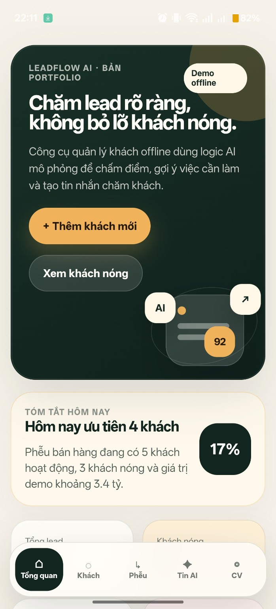
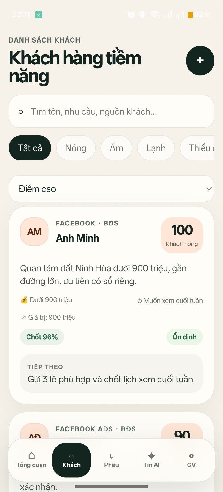
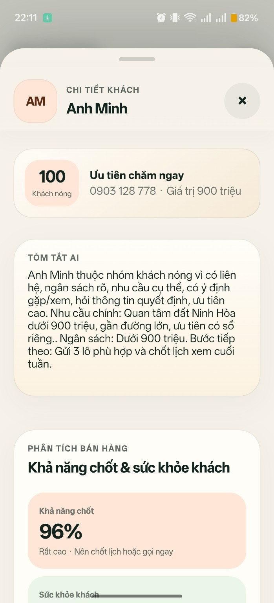
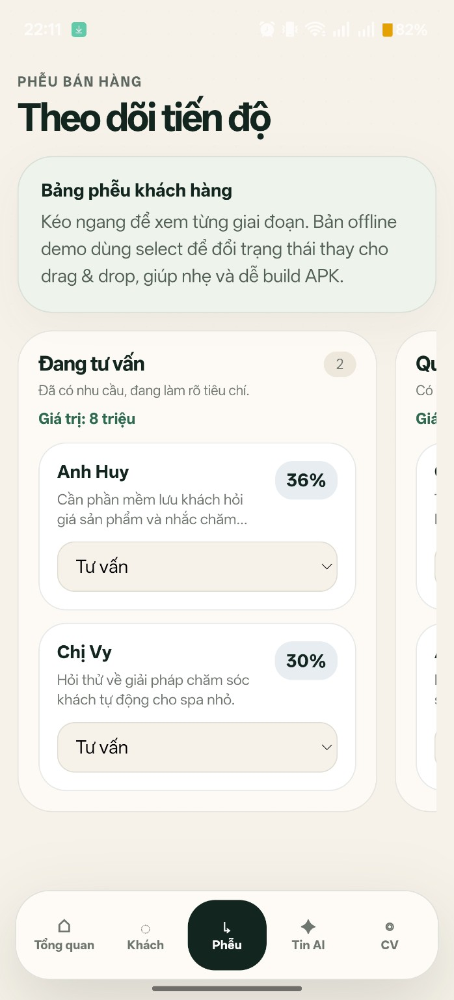
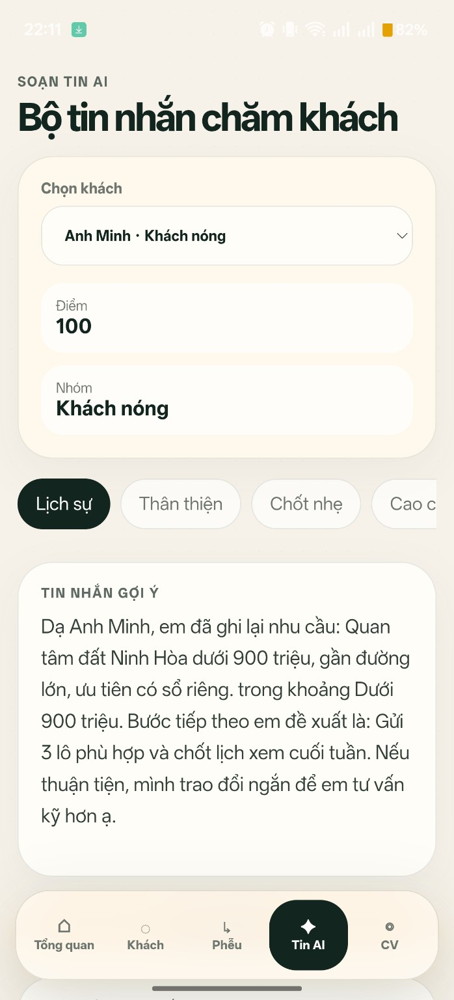

# LeadFlow AI — Offline Sales Intelligence CRM

<p align="center">
  <strong>Vietnamese-first mobile CRM prototype for lead management, AI-style scoring, sales pipeline tracking, and Android APK demo.</strong>
</p>

<p align="center">
  
  
  
  
  
  
</p>

---

## Ảnh demo / Preview

<p align="center">
  
  
  
  
  
</p>

---

## Giới thiệu nhanh

**LeadFlow AI** là một prototype app CRM mini dành cho người bán hàng, môi giới bất động sản, freelancer và doanh nghiệp nhỏ tại Việt Nam.

Ứng dụng giúp người dùng quản lý khách hàng tiềm năng ngay trên điện thoại, theo dõi phễu bán hàng, chấm điểm mức độ quan tâm bằng logic offline, gợi ý việc cần làm và tạo tin nhắn chăm sóc khách hàng.

> Đây là dự án portfolio chạy offline. App không dùng backend, không đăng nhập, không database cloud và không gọi API AI bên ngoài.

---

## Why this project exists

This project was built as a **portfolio-ready AI product prototype** to demonstrate:

- Mobile-first product design for Vietnamese non-technical users.
- Rule-based AI automation without external AI APIs.
- Offline-first data persistence with LocalStorage.
- Lead scoring, deal probability, follow-up planning, and message generation.
- Android APK packaging with Capacitor.
- A clear GitHub/CV-ready product presentation.

---

## Đối tượng sử dụng

LeadFlow AI phù hợp với:

- Môi giới bất động sản.
- Nhân viên sale/tư vấn.
- Người bán hàng online.
- Chủ shop nhỏ, spa, quán cafe, dịch vụ địa phương.
- Freelancer cần quản lý khách hàng tiềm năng đơn giản.

---

## Tính năng chính

### 1. Quản lý khách hàng tiềm năng

Lưu thông tin khách hàng như tên, số điện thoại, nguồn khách, ngành/lĩnh vực, nhu cầu, ngân sách, ghi chú và trạng thái tư vấn.

### 2. AI Lead Scoring offline

App mô phỏng cơ chế chấm điểm khách hàng bằng rule-based logic, dựa trên các tín hiệu như:

- Có số điện thoại.
- Có ngân sách rõ ràng.
- Có nhu cầu cụ thể.
- Có ý định xem/gặp trực tiếp.
- Hỏi giá, pháp lý hoặc thông tin ra quyết định.

Kết quả được phân loại thành:

```text
Khách nóng → Khách ấm → Khách lạnh → Cần thêm thông tin
```

### 3. Deal Probability

Mô phỏng khả năng chốt khách để giúp người dùng biết khách nào nên được ưu tiên chăm sóc trước.

### 4. Lead Health

Phát hiện khách hàng có nguy cơ bị bỏ quên:

- Khách cần chăm sóc hôm nay.
- Khách nóng cần follow-up nhanh.
- Khách đã lâu chưa liên hệ.
- Khách có khả năng mất cơ hội nếu không xử lý kịp.

### 5. Message Studio

Tạo tin nhắn chăm sóc khách hàng theo ngữ cảnh:

- Chào khách mới.
- Follow-up khách đang phân vân.
- Gửi thông tin/bảng giá.
- Chốt lịch hẹn.
- Chăm lại khách cũ.

### 6. Objection Handling

Gợi ý phản hồi khi khách nói:

```text
"Giá cao"
"Để suy nghĩ thêm"
"Chưa cần gấp"
"Gửi xem trước"
"Đang tham khảo thêm"
```

### 7. Sales Pipeline

Theo dõi khách qua các giai đoạn:

```text
Mới → Đang tư vấn → Quan tâm cao → Hẹn gặp → Đã chốt → Đã mất
```

### 8. Offline-first

LeadFlow AI được thiết kế để chạy nhẹ, không phụ thuộc server:

- Không cần tài khoản.
- Không cần backend.
- Không cần database online.
- Không cần API AI thật.
- Dữ liệu lưu local bằng LocalStorage.

---

## Tech Stack

| Layer | Technology |
|---|---|
| Frontend | React + Vite |
| Mobile packaging | Capacitor Android |
| Styling | CSS / Tailwind-style mobile UI |
| Storage | LocalStorage |
| Logic | JavaScript rule-based automation |
| Build environment | GitHub Codespaces |
| Backend | None |
| Auth | None |
| Online database | None |
| AI API | None in MVP |

---

## Project Structure

```text
LeadFlow-AI/
├─ android/                 # Android project generated by Capacitor
├─ docs/                    # Project docs and screenshots
│  └─ screenshots/          # README screenshots
├─ public/                  # Static assets
├─ scripts/                 # Helper scripts
├─ src/                     # Main source code
├─ BUILD_APK.md             # APK build guide
├─ README.md                # Project documentation
├─ capacitor.config.ts      # Capacitor configuration
├─ package.json             # Dependencies and scripts
└─ vite.config.js           # Vite configuration
```

---

## Run Locally

```bash
git clone https://github.com/Megatavn/LeadFlow-AI.git
cd LeadFlow-AI
npm install
npm run dev
```

Build web app:

```bash
npm run build
```

---

## Build Android APK

This project uses Capacitor to package the web app into an Android APK.

```bash
npm run build
npx cap sync android
cd android
./gradlew assembleDebug
```

APK output:

```text
android/app/build/outputs/apk/debug/app-debug.apk
```

If the Android platform does not exist yet:

```bash
npx cap add android
npx cap sync android
```

---

## APK Demo

You can download the APK demo from the **Releases** section of this repository.

Recommended release title:

```text
LeadFlow AI v2.6 APK Demo
```

---

## Portfolio Highlights

This project is designed to show the following capabilities:

- Product thinking for a real business workflow.
- Mobile-first UI/UX for Vietnamese users.
- Offline-first app architecture.
- Rule-based AI automation without paid API dependencies.
- LocalStorage persistence.
- Android APK packaging with Capacitor.
- GitHub-ready documentation with screenshots, changelog and release APK.

---

## Current Limitations

This is a portfolio prototype, so it does not include:

- User authentication.
- Cloud sync.
- Backend/server.
- Online database.
- Real AI API integration.
- Zalo/Facebook/Google Sheets integration.
- Real push notification.
- Multi-user team collaboration.

The current AI features are simulated with rule-based logic to keep the MVP lightweight, offline and easy to demo.

---

## Roadmap

### Next portfolio improvements

- Add more industry-specific message templates.
- Add import/export JSON or CSV.
- Improve mobile layout consistency across screen sizes.
- Add a short demo video/GIF to the README.
- Add a case-study section explaining product decisions.

### Commercial upgrade ideas

- User accounts.
- Cloud database.
- Multi-device sync.
- Real AI API integration.
- Zalo/Facebook/Google Sheets integration.
- Free/Pro subscription model.
- Team workspace and shared pipeline.

---

## CV Description

```text
LeadFlow AI — Offline Sales Intelligence CRM Prototype

Built a Vietnamese mobile-first CRM prototype with rule-based AI lead scoring, deal probability, lead health tracking, follow-up timeline, objection handling, message generation, sales pipeline management, LocalStorage persistence, and Android APK packaging with Capacitor.

Tech stack: React, Vite, Capacitor Android, JavaScript, LocalStorage.
```

Short CV bullet:

```text
Built LeadFlow AI, an offline-first Vietnamese CRM prototype that helps small businesses manage leads, score customer intent, generate follow-up messages, track pipeline stages, and package the app as an Android APK with Capacitor.
```

---

## Suggested GitHub About

**Description**

```text
Vietnamese offline CRM prototype with AI-style lead scoring, sales pipeline, message generator, LocalStorage persistence, and Android APK demo.
```

**Topics**

```text
react
vite
capacitor
android
crm
lead-management
ai-automation
sales-automation
offline-first
localstorage
portfolio
vietnamese-app
```

---

## Author

**Vũ Hoàng**  
AI Product Builder / AI Automation Portfolio

GitHub: [Megatavn](https://github.com/Megatavn)

---

## License

This project is released under the MIT License.
